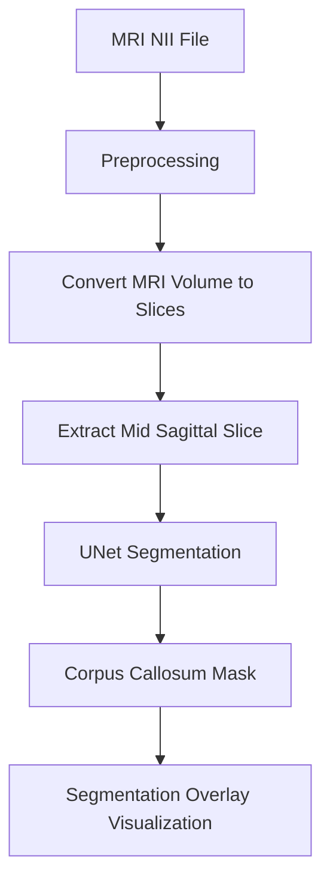

# AI-Assisted Analysis of Infant Brain MRI for Early Neurodevelopment Risk Assessment

## Pipeline Diagram



## Overview
This project provides a modular pipeline for automated analysis of infant brain MRI scans, focusing on early detection of neurodevelopmental risks. Leveraging deep learning and image processing, the system segments the corpus callosum from mid-sagittal MRI slices, enabling quantitative and qualitative assessment for research and clinical applications.

## Pipeline Explanation
The pipeline consists of the following stages:
1. **Load MRI Data**: Reads .nii MRI files and prepares them for processing.
2. **Convert MRI Volumes to Slices**: Extracts 2D slices from 3D MRI volumes for downstream analysis.
3. **Extract Mid-Sagittal Slice**: Identifies and saves the central sagittal slice, which is critical for corpus callosum segmentation.
4. **Corpus Callosum Segmentation**: Applies a U-Net deep learning model to segment the corpus callosum from the mid-sagittal slice.
5. **Visualization**: Generates overlays of segmentation masks on MRI slices for visual inspection and result validation.

## Project Structure
```
data/
    raw/                # Original MRI .nii files
    processed/          # Processed slices, masks, overlays
models/
    unet_segmentation.py # U-Net model definition
scripts/
    convert_mri_to_slices.py
    extract_mid_slice.py
    load_mri.py
    run_segmentation.py
    visualize_segmentation.py
utils/
    image_utils.py      # Reusable preprocessing functions
notebooks/              # Jupyter notebooks for experiments
results/                # Output visualizations and metrics
```

## Installation
1. Clone the repository:
   ```bash
   git clone <repo-url>
   cd <repo-folder>
   ```
2. Create and activate a Python 3.10+ virtual environment:
   ```bash
   python -m venv .venv
   .venv\Scripts\activate   # Windows
   source .venv/bin/activate # Linux/Mac
   ```
3. Install dependencies:
   ```bash
   pip install -r requirements.txt
   ```

## How to Run the Pipeline
1. Place your MRI .nii files in `data/raw/`.
2. Run the scripts in sequence:
   - Convert MRI to slices:
     ```bash
     python scripts/convert_mri_to_slices.py
     ```
   - Extract mid-sagittal slice:
     ```bash
     python scripts/extract_mid_slice.py
     ```
   - Run segmentation:
     ```bash
     python scripts/run_segmentation.py
     ```
   - Visualize segmentation:
     ```bash
     python scripts/visualize_segmentation.py
     ```

## Example Outputs
- **Processed Slices**: `data/processed/slices/`
- **Mid-Sagittal Slice**: `data/processed/mid_slice.png`
- **Segmentation Mask**: `data/processed/segmentation_mask.png`
- **Segmentation Overlay**: `data/processed/segmentation_overlay.png`

## Future Work
- Integrate clinical metadata for risk prediction
- Expand segmentation to other brain regions
- Improve model accuracy with larger datasets
- Add interactive visualization tools
- Develop automated reporting for clinical use

---
For questions or contributions, please open an issue or submit a pull request.
